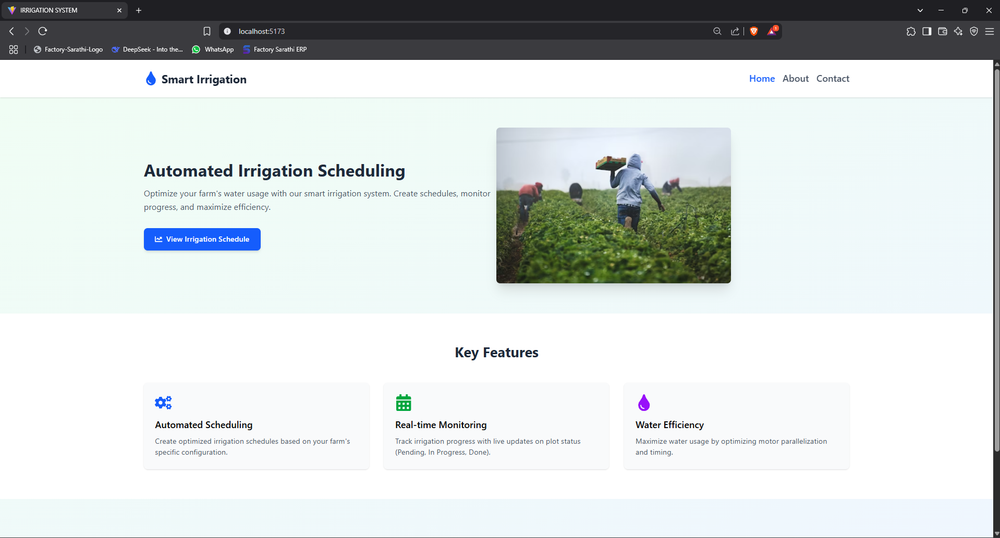
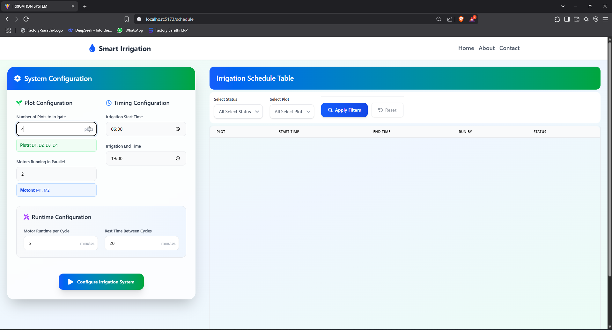
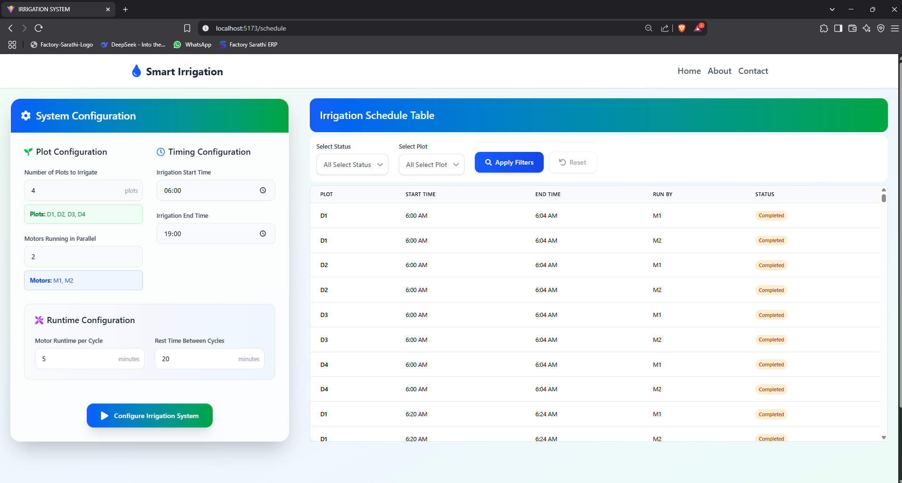

# React# 🌿 Irrigation System IoT Web App

A responsive and interactive web application built with **React.js**, **Vite**, and **Tailwind CSS** to automate irrigation cycles for IoT-based farming systems. This project was developed as an interview assignment to demonstrate problem-solving, UI design, and real-time scheduling logic.

---

## 🚀 Live Demo

- 🔗 [Netlify Deployment](https://irrigationsys.netlify.app/)
- 🔗 [Vercel Deployment](https://irrigationsystem-gamma.vercel.app/)

---

## 🧠 Features

- Configure:
  - Number of plots (e.g., D1, D2, ...)
  - Number of motors (e.g., M1, M2, ...)
  - Irrigation start and end time (military format)
  - Motor runtime duration
  - Cycle interval between irrigation batches
- Auto-generate optimized irrigation cycles
- Real-time status tracking:
  - ✅ Done
  - 🔄 In Progress
  - ⏳ Pending
- Time format conversion:
  - Converts military time (e.g., `070000`) to human-readable AM/PM format
- Table view with filters:
  - Filter by plot
  - Filter by status
- Clean, responsive UI inspired by modern dashboard designs
- Deployed on both **Vercel** and **Netlify** for high availability

---

## 🛠️ Tech Stack

- **React.js** (Frontend Framework)
- **Vite** (Build Tool)
- **Tailwind CSS** (Styling)
- **Netlify / Vercel** (Deployment)

---

## 📸 Screenshots




---

## 📦 Getting Started

To run the project locally:

```bash
git clone https://github.com/Harshad1304/irrigationsystem.git
cd irrigationsystem
npm install
npm run dev
```

📁 Project Structure

```
src/
├── components/        # Reusable UI components
├── utils/             # Helper functions (e.g., time conversion)
├── data/              # Sample mock data
├── pages/             # Main page views
└── App.jsx            # Main application entry point
```

🧾 License

This project is for evaluation purposes only. Not intended for production or commercial use.

🙌 Acknowledgements

- Icons from flaticon.com
- UI Inspiration from Behance Design
